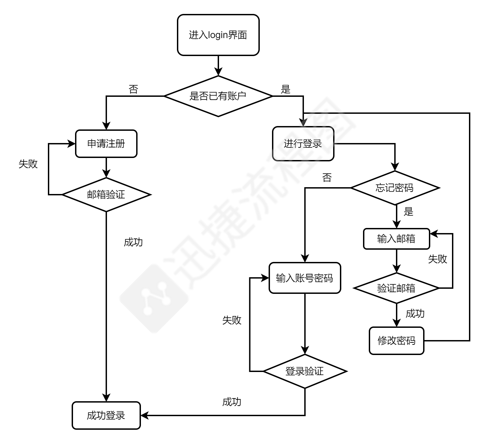

# 一个学习共享室式样的网站
## 想法来源🙋‍♀️🙋‍♂️
    目前国内的学习讨论小组普遍是一种依托于社交平台如qq、微信等而存在，就涉及的功能而言，并不能满足需求，且受到传输文件的大小限制。
    因此想要设计一个适合小组成员学习分享的交流平台。
## 暂拟定开发工具
- python3.8 可视化界面：Pycharm2015
- 前端设计：BootStrap
- 云服务器 参考资料[阿里云开发工具包（SDK）](https://develop.aliyun.com/tools/sdk?#/python)
## 拟实现的功能
- [登录界面](#登录界面)
- [自定义学习计划](#自定义学习计划)
- [自定义学习小组](#自定义学习小组)
- [小组内文件和视频传输功能](#小组内文件和视频传输功能)
- [视频增设书签节点](#视频增设书签节点)
- [实时聊天与视频](#实时聊天与视频)
- [关键字检索书籍的功能](#关键字检索书籍的功能)

### 登录界面
- 流程图：

暂定参考资料[Python+django实现邮箱验证登录](https://blog.csdn.net/Com_ma/article/details/77990099)
- 用户需要通过注册账号密码，并且邮箱验证后方可成功注册成为用户。
### 自定义学习计划
- 流程图：

- 用户可以自定义每日学习计划内容，相当于一个美化了的备忘录，并再此基础上设置了提醒功能。可以在用户规定的某时间，下发邮件提醒用户上线查看自己的每日计划。
### 自定义学习小组
- 用户可以自定义学习小组的参数，诸如最大人数、小组的名字和简单介绍。

### 小组内文件和视频传输功能
- 小组成员可以上利用django的filefield实现视频上传传有关的文件和音频

**参考资料：** 
- [利用django的filefield实现视频上传](https://blog.csdn.net/huatoudd/article/details/111992835) 
- [用django进行文件的上传](https://blog.csdn.net/qq_26870933/article/details/83304136)

### 视频增设书签节点
 - 观看人员可以对群内视频的某处节点做标记，并作简单介绍,比如说明这个节点是讲解哪块知识点。有点类似于书签功能，其他人可以通过点击此标记，跳转到该节点 ，观看对应的知识内容。
### 实时聊天与视频
暂拟定参考资料
- [Python实现网络多人聊天室](https://www.cnblogs.com/rrxc/p/4530626.html)
- [https://github.com/suliangxd/ChatRoom](https://github.com/suliangxd/ChatRoom)
### 关键字检索书籍的功能
- 通过调用接口，访问其他书库类服务器的内容。当用户想要检索有关某一方面的书目时，就可以在web端，推荐有关方面的书籍。

## 进度计划
**月进度和周进度结合的方式进行**
- 暂先拟定3月份计划：完成服务器搭建+登录界面功能实现+主页面布局+自定义学习计划的功能实现
- 分周进度进行汇报，四周内完成3月份计划，若提前完成可更新ReadMe进入下一阶段。

